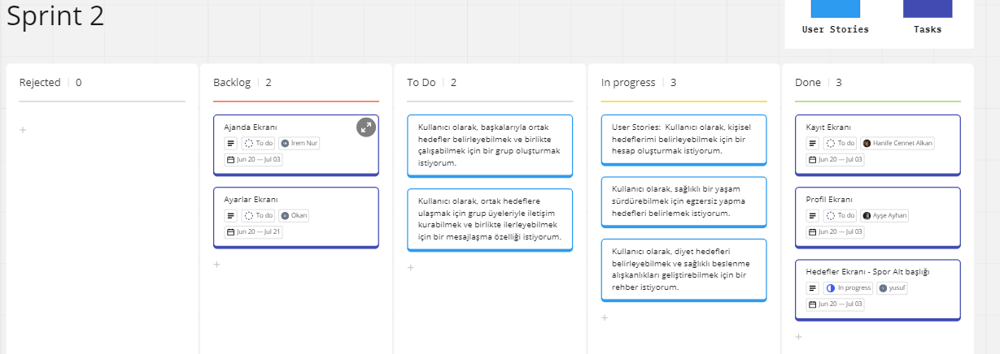
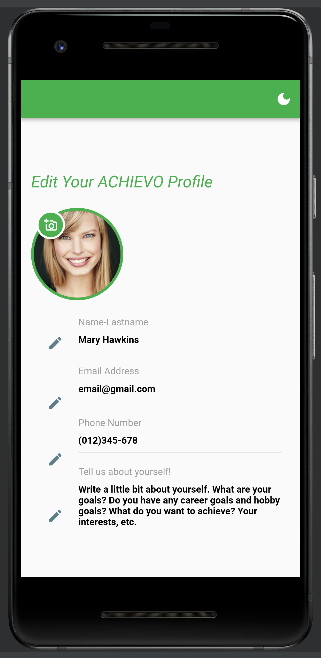
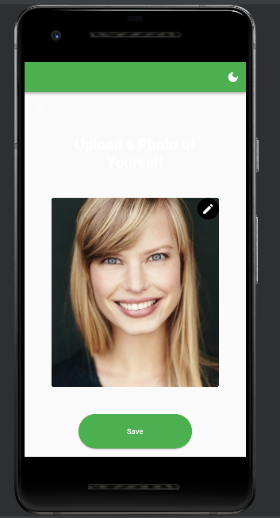
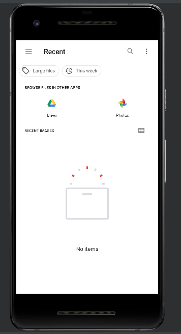
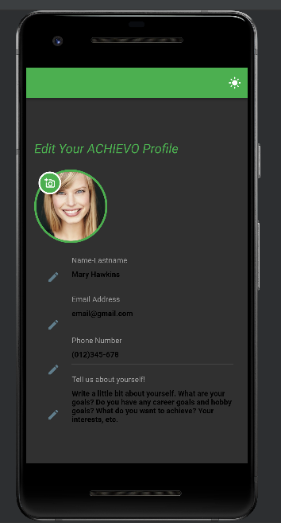
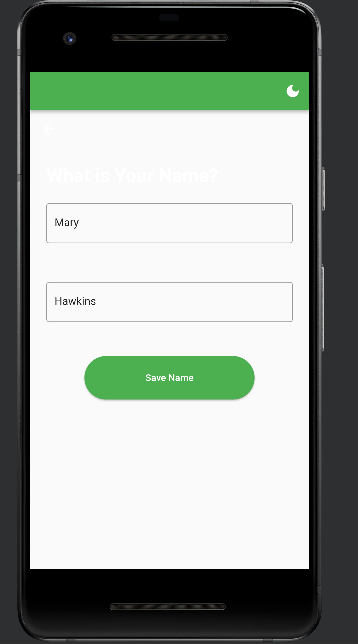
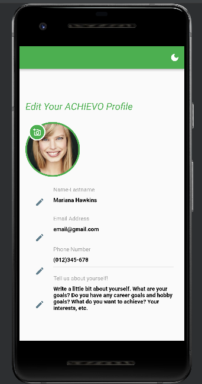

# Takım İsmi
Takım Flutter 24

# Ürün ile İlgili Bilgiler
## Takım Elemanları
- **Ayşe Ayhan:** Scrum Master/Developer
- **Hanife Cennet Alkan:** Product Owner/Developer
- **Yusuf Alçı:** Developer
- **Okan Patır:** Developer
- **İrem Nur Pirinççi:** Developer

## Ürün İsmi
Achievo

## Product Backlog URL
[Flutter Team 52 Miro Backlog Board](https://miro.com/app/board/uXjVM9tRAU0=/#tpicker-content)

## Ürün Açıklaması

Yaşamın hızı ve yoğunluğu içinde, bireyler genellikle hedeflerini belirlemek ve onlara ulaşmak için zaman, motivasyon ve organizasyon eksikliği yaşayabilirler. Uygulamamız, bu sorunları çözmek için ideal bir çözümdür. Hedeflerinizi belirlemenize, alt başlıklar eklemenize ve gerçekleştirdiğinizde motivasyon sağlayacak ödüller ve rozetler kazanmanıza yardımcı olmayı amaçlar. Bunun yanı sıra, ortak hedefler üzerinden insanları bir araya getirerek bir topluluk oluşturmanızı sağlar. Hatırlatıcı-alarm fonksiyonları, planlayıcılar ve ajandalar gibi kullanışlı araçları içerir.

Uygulamamız, modern yaşamın getirdiği taleplerle başa çıkmak için kullanıcılara yardımcı olan çok yönlü bir araç olarak öne çıkmaktadır. Hedeflere odaklanmanızı sağlar, motivasyonu artırır, hatırlatıcılarla takibi kolaylaştırır, topluluk etkileşimine katılımı teşvik eder ve daha fazlasını sunar. Bireylerin hedeflerine odaklanmalarına, organize olmalarına ve başarılarını kutlamalarına yardımcı olan bir uygulama olarak ihtiyaç duyulan bir çözüm sunmaktadır.

## Ürün Özellikleri

- **Hedef Belirleme ve Odaklanma:** Uygulama, kullanıcılara hedeflerini belirlemek, onları alt başlıklara bölerek daha yönetilebilir hale getirmek ve bu hedeflere odaklanmak için güçlü bir platform sağlar. Bu, bireylerin hayatlarında gerçek ilerleme kaydetmelerine ve daha organize olmalarına yardımcı olur.
- **Motivasyon ve Ödüller:** İnsanlar, hedeflerine ulaşmaya teşvik edildiklerinde daha fazla motive olurlar. Uygulamamız, hedefleri gerçekleştirdikçe kullanıcılara ödüller, rozetler veya temalar sunarak bu motivasyonu artırır. Bu, başarıların kutlanmasını ve sürece olan bağlılığı güçlendirir.
- **Topluluk ve Ortak Hedefler:** İnsanlar genellikle benzer ilgi alanlarına sahip diğer kişilerle etkileşimde bulunmak ve bir topluluk içinde yer almak isterler. Uygulamamız, ortak hedefler etrafında insanları bir araya getirir ve birbirlerine destek olmalarını sağlar. Bu topluluk, motive edici bir ortam sağlar ve ilham verici deneyimler sunar.
- **Hatırlatıcı-Alarm Fonksiyonları:** Yoğun bir yaşam tarzı içinde hedeflere odaklanmak zor olabilir. Uygulamamız, hatırlatıcı ve alarm özellikleriyle kullanıcıların hedeflerine düzenli olarak dönmesini sağlar. Bu sayede önemli adımları kaçırmadan hedeflerinize odaklanabilirsiniz.
- **Planlayıcılar ve Ajandalar:** Uygulamamız, günlük, haftalık veya aylık planlamalarınızı yapmanızı ve ajandanızı yönetmenizi sağlar. Bu özellikler, iş, eğitim veya kişisel yaşamınızdaki önemli görevleri organize etmenize yardımcı olur. Görevlerinizi takip etmek, zamanlama çakışmalarını önlemek ve verimliliği artırmak için kullanışlıdır.
- **Kişiselleştirme ve Tema Değişimi:** Uygulamamız, kişiselleştirme seçenekleri sunarak kullanıcıların kendi tercihlerine göre uygulamayı şekillendirmesine olanak tanır. Tema değişimi özelliği sayesinde, hedeflerinizi gerçekleştirdikçe otomatik olarak tema değişimi yaparak motivasyonu artırır. Bu, kullanıcıların uygulamanın hissini kendi tarzlarına ve tercihlerine göre ayarlamalarına olanak sağlar.
- **Yaratıcı ve Eğlenceli Fonksiyonlar:** Uygulamamız, sıradan hedef takibi uygulamalarından farklı olarak yaratıcı ve eğlenceli fonksiyonlar sunar. Ödüller, rozetler, başarı sıralamaları ve belki de yarışmalar gibi öğelerle kullanıcıların deneyimini daha keyifli ve heyecan verici hale getirir. Bu da uzun vadede motivasyonu artırır ve kullanıcıların hedeflerine daha bağlı olmalarını sağlar.

## Hedef Kitle
Bu uygulama, hedef belirleme, kişisel gelişim ve motivasyon konularına ilgi duyan bireyler için idealdir. 
- Öğrenciler, 
- Profesyoneller,
- Girişimciler veya
- Hayatlarında hedeflere ulaşmak, organize olmak ve bir topluluk içinde yer almak isteyenler 
bu uygulamadan faydalanabilir.
		
## Jüriye Not
--

---

# Sprint 1

**Sprint içinde tamamlanması tahmin edilen puan:** 100

**Puan tamamlama mantığı:** Toplamda proje boyunca tamamlanması gereken 440 puanlık backlog bulunmaktadır. 4 sprint'e bölündüğünde ilk sprint'in en azından 100 ile başlaması gerektiğine karar verildi.

**Daily Scrum:** Topantılarımız Google meet üzerinden yapıldı, WhatsApp ise haberleşme ve planlama için kullanıldı. Detaylar, Daily Scrum dosyasında paylaşılmıştır.
[Daily Scrum Dosyası](DailyScrum_F24.docx)

- **Sprint Board Ekran Görüntüsü:**

- **Ürün Ekran Görüntüsü:**

- **Sprint Review:**
Kullanıcının bazı temel sayfaları, arayüzleri oluşturulmuş ve kodlanmıştır; eksiklikler dikkate alınmıştır. 
Aktif Kullanıcılar: Ayşe Ayhan, Hanife Cennet Alkan, Yusuf Alçı, Okan Patır

- **Sprint Retrospective:**

Takım üyelerinin gelecek sprintlerde fikir paylaşma konusunda ve kod üzerinde çalışmak için daha aktif olması gerektiğine vurgu yapılmıştır.

## Product Backlog URL
[Flutter Team 52 Miro Backlog Board](https://miro.com/app/board/uXjVM9tRAU0=/#tpicker-content)

---

---
---

# Sprint 2

**Sprint Notları:** User Story'ler product backlog'ların içinde, mavi kutular ile belirtilmiştir. Product backlog item'lara tıklandığında hikayelerin detayları okunabilir, gerçekleştirilecek olan user story'ler To Do başlığı altında, yapım sürecindekiler In Progress başlığı altındadır.

**Sprint içinde tamamlanması tahmin edilen puan:** 100

**Puan tamamlama mantığı:** Toplamda proje boyunca tamamlanması gereken 440 puanlık backlog bulunmaktadır. 4 sprint'e bölündüğünde İkinci sprint'in en az 100 puan ile ilerlemesi gerektiğine karar verildi.

**Backlog düzeni ve Story seçimleri:** Product Backlog'umuz yapılacak ilk story'lere göre düzenlenmiştir. Uygulamamızın her işlevi için ayrı user story'ler belirlenmiş ve yapılma durumuna göre Backlog tablosuna yerleştirilmiştir.

Story'ler yapılacak işlere (task'lere) bölünmüştür. Miro Board'da gözüken kırmızı item'lar yapılacak işleri (task) gösterirken, mavi item'lar story'leri temsil etmektedir.

**Daily Scrum:** Topantılarımız Google meet üzerinden yapıldı, WhatsApp ise haberleşme ve planlama için kullanıldı. Detaylar, Daily Scrum dosyasında paylaşılmıştır.
[Daily Scrum Dosyası-2](F24_sprint2_dailyscrum.docx)

- **Sprint Board Ekran Görüntüsü:**

- **Ürün Ekran Görüntüsü:**

- **Sprint Review:**
Profil ekranı eklenmiş, kullanıcının bilgilerini girebileceği ve düzenleyebileceği bir arayüz sağlanmıştır. Hedef ekranı güncellenmiştir. Firebase üzerinde çalışılmaya başlanmıştır. 
Katılımcılar: Ayşe Ayhan, Hanife Cennet Alkan, Yusuf Alçı.

- **Sprint Retrospective:**

Takım üyelerinin gelecek sprintlerde kod üzerinde çalışmak için daha çok bir araya gelmesine ve yardımlaşmasına karar verildi.

## Product Backlog URL
[Flutter Team 52 Miro Backlog Board](https://miro.com/app/board/uXjVM9tRAU0=/)

---

# Sprint 3

- **Sprint Board Ekran Görüntüsü:**

